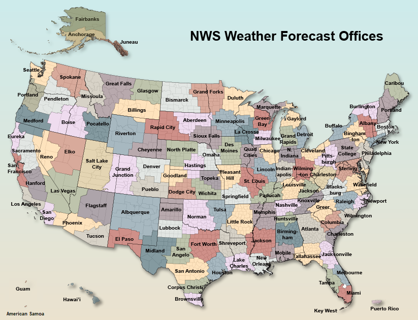

# US Historical WEATHER

This repo contains US historical weather data from the 1850 to November 2025.

All data was retrieved from https://www.weather.gov/wrh/climate with data from the Natinal Oceanic and Atmospheric Administration and 
the National Weather Service December 2025.

Each record is a csv with the following:
- date
- high (F)
- low (F)
- precipitation inches
- snow inches
- snow depth inches

 

Other fields are available at https://www.weather.gov/wrh/climate such as pressure and other measurements.

In this repo you'll find folders labeled by region, each containing csvs with weather data for each city in that region. Some cities
have longer historical records than others. To find a specific city consult the map below (or search the repo):

And find the region code in the table below:

| Region Name    | Region Code |
|----------------|-------------|
| Aberdeen       | abr         |
| Albany         | aly         |
| Albquerque     | abq         |
| Amarillo       | ama         |
| American Somoa | ppg         |
| Anchorage      | afc         |
| Atlanta        | ffc         |
| Billings       | byz         |
| Binghamton     | bgm         |
| Birmingham     | bmx         |
| Bismarck       | bis         |
| Blacksburg     | rnk         |
| Boise          | boi         |
| Boston         | box         |
| Brownsville    | bro         |
| Buffalo        | buf         |
| Burlington     | btv         |
| Caribou        | car         |
| Cleveland      | cle         |
| Charleston     | rlx         |
| Charleston     | chs         |
| Cheyenne       | cys         |
| Chicago        | lot         |
| Columbia       | cae         |
| Corpus Cristi  | crp         |
| Denver         | bou         |
| Des Moines     | dmx         |
| Detroit        | dtx         |
| Dodge City     | ddc         |
| Duluth         | dlh         |
| Elko           | lkn         |
| El Paso        | epz         |
| Eureka         | eka         |
| Fairbanks      | afg         |
| Fort Worth     | fwd         |
| Flagstaff      | fgz         |
| Gaylord        | apx         |
| Glasgow        | ggw         |
| Goodland       | gld         |
| Grand Forks    | fgf         |
| Grand Junction | gjt         |
| Grand Rapids   | grr         |
| Great Falls    | tfx         |
| Green Bay      | grb         |
| Greer          | gsp         |
| Guam           | gum         |
| Handford       | hnx         |
| Hastings       | gid         |
| Hawaii         | hfo         |
| Houston        | hgx         |
| Huntsville     | hun         |
| Indianapolis   | ind         |
| Jackson        | jkl         |
| Jackson        | jan         |
| Jacksonville   | jax         |
| Janeau         | ajk         |
| Knoxville      | mrx         |
| La Crosse      | arx         |
| Lake Charles   | lch         |
| Las Vegas      | vef         |
| Lincoln        | ilx         |
| Little Rock    | lzk         |
| Los Angeles    | lox         |
| Louisville     | lmk         |
| Lubbock        | lub         |
| Marquette      | mqt         |
| Medford        | mfr         |
| Melbourne      | mlb         |
| Memphis        | meg         |
| Miami          | mfl         |
| Midland        | maf         |
| Milwaukee      | mkx         |
| Minneapolis    | mpx         |
| Missoula       | mso         |
| Mobile         | mob         |
| Nashville      | ohx         |
| New Orleans    | lix         |
| Newport        | mhx         |
| New York       | okx         |
| N. Indiana     | iwx         |
| Norman         | oun         |
| North Platte   | lbf         |
| Omaha          | oax         |
| Paducah        | pah         |
| Pendleton      | pdt         |
| Phoenix        | psr         |
| Philadelphia   | phi         |
| Pittsburgh     | pbz         |
| Pleasant Hill  | eax         |
| Pocatello      | pih         |
| Portland       | pqr         |
| Portland       | gyx         |
| Pueblo         | pub         |
| Puerto Rico    | sju         |
| Quad Cities    | dvn         |
| Raleigh        | rah         |
| Rapid City     | unr         |
| Reno           | rev         |
| Riverton       | riw         |
| Sacramento     | sto         |
| San Angelo     | sjt         |
| San Antonio    | ewx         |
| San Francisco  | mtr         |
| San Diego      | sgx         |
| Salt Lake City | slc         |
| Seattle        | sew         |
| Shreveport     | shv         |
| Sioux Falls    | fsd         |
| Spokane        | otx         |
| Springfield    | sgf         |
| State College  | ctp         |
| Sterling       | lwx         |
| St. Louis      | lsx         |
| Tallahassee    | tae         |
| Tampa          | tbw         |
| Topeka         | top         |
| Tucson         | twc         |
| Tulsa          | tsa         |
| Wakefield      | akq         |
| Wichita        | ict         |
| Wilmington     | iln         |
| Wilmington     | ilm         |

## Oldest Records
Some cities have records that go back much further. Here's a list of some of the oldest ones

||
|-|
|1850 /okx/Newark Airport, NJ.csv|
|1850 /sgx/San Diego Area.csv|
|1850 /ctp/Carlisle Water Plnt, PA.csv|
|1850 /mtr/San Francisco City, CA.csv|
|1852 /rnk/Lewisburg 3 N, WV.csv|
|1856 /sto/Sacramento Area.csv|
|1856 /pqr/Vancouver 4NNE, WA.csv|
|1856 /pqr/Vancouver Area.csv|
|1857 /ffc/Athens Area.csv|
|1857 /mqt/Marquette, MI.csv|
|1858 /phi/Reading 4 SW, PA.csv|
|1858 /phi/Reading Area.csv|
|1863 /grr/Lansing Area.csv|
|1865 /phi/Trenton Area.csv|
|1868 /gyx/Concord Area.csv|
|1869 /okx/NY-Central Park Area.csv|
|1869 /okx/NY Central Park, NY.csv|
|1869 /gsp/Asheville Area.csv|
|1869 /mkx/Madison Area.csv|

And here are all the records that start before 1900

||
|-|
|1850 /okx/Newark Airport, NJ.csv|
|1850 /sgx/San Diego Area.csv|
|1850 /ctp/Carlisle Water Plnt, PA.csv|
|1850 /mtr/San Francisco City, CA.csv|
|1852 /rnk/Lewisburg 3 N, WV.csv|
|1856 /sto/Sacramento Area.csv|
|1856 /pqr/Vancouver 4NNE, WA.csv|
|1856 /pqr/Vancouver Area.csv|
|1857 /ffc/Athens Area.csv|
|1857 /mqt/Marquette, MI.csv|
|1858 /phi/Reading 4 SW, PA.csv|
|1858 /phi/Reading Area.csv|
|1863 /grr/Lansing Area.csv|
|1865 /phi/Trenton Area.csv|
|1868 /gyx/Concord Area.csv|
|1869 /okx/NY-Central Park Area.csv|
|1869 /okx/NY Central Park, NY.csv|
|1869 /gsp/Asheville Area.csv|
|1869 /mkx/Madison Area.csv|
|1870 /ilm/Wilmington Area.csv|
|1870 /rah/Tarboro 1 S, NC.csv|
|1870 /lwx/Romney 1 Sw, WV.csv|
|1871 /ind/Indianapolis Area.csv|
|1871 /hgx/Galveston Area.csv|
|1871 /hgx/Galveston (coop], TX.csv|
|1871 /ohx/Nashville Area.csv|
|1871 /shv/Shreveport Area.csv|
|1871 /meg/Pocahontas 1, AR.csv|
|1871 /phi/Philadelphia Area.csv|
|1871 /jax/Jacksonville Area.csv|
|1871 /chs/Savannah Area.csv|
|1871 /pbz/Pittsburgh Area.csv|
|1871 /oax/Omaha Area.csv|
|1871 /dvn/Moline Area.csv|
|1871 /gsp/Lenoir, NC.csv|
|1871 /cae/Augusta Area.csv|
|1871 /mob/Mobile Area.csv|
|1871 /iln/Cincinnati Area.csv|
|1871 /mkx/Milwaukee Area.csv|
|1871 /gyx/Portland Area â PCPN Only.csv|
|1871 /cle/Toledo Area.csv|
|1871 /cle/Cleveland Area.csv|
|1871 /cys/Cheyenne Area.csv|
|1871 /rah/Fayetteville, NC.csv|
|1871 /mpx/Minneapolis Area.csv|
|1871 /buf/Rochester Area.csv|
|1871 /buf/Buffalo Area.csv|
|1871 /dlh/Duluth Area.csv|
|1871 /lwx/Baltimore Area.csv|
|1871 /lwx/Washington Area.csv|
|1871 /mrx/Knoxville Area.csv|
|1871 /lot/Chicago Area.csv|
|1872 /arx/La Crosse Area.csv|
|1872 /bmx/Montgomery Area.csv|
|1872 /meg/Memphis Area.csv|
|1872 /pbz/Morgantown Area.csv|
|1872 /pbz/Morgantown Hart, WV.csv|
|1872 /gsp/Franklin, NC.csv|
|1872 /bou/Denver Area.csv|
|1872 /pqr/Portland Downtown Area.csv|
|1872 /lmk/Lexington Area.csv|
|1872 /lmk/Lexington Bluegr, KY.csv|
|1872 /lmk/Louisville Area.csv|
|1872 /lzk/Mount Ida Area.csv|
|1872 /mrx/Murphy, NC.csv|
|1872 /box/Boston Area.csv|
|1873 /phi/Atlantic City Marina Area.csv|
|1873 /phi/Atlantic City Marina, NJ.csv|
|1873 /dvn/Dubuque Area.csv|
|1873 /cle/Erie Area.csv|
|1874 /bis/Bismarck Area.csv|
|1874 /bis/Bismarck Municip, ND.csv|
|1874 /lsx/St Louis Area.csv|
|1874 /lbf/North Platte Area.csv|
|1874 /ffc/Dahlonega 4WSW, GA.csv|
|1874 /phi/Freehold Marlboro, NJ.csv|
|1874 /ddc/Dodge City Area.csv|
|1874 /akq/Norfolk Area.csv|
|1874 /aly/Albany Area.csv|
|1874 /dtx/Detroit Area.csv|
|1874 /slc/Salt Lake City Area.csv|
|1875 /mhx/Greenville, NC.csv|
|1875 /boi/Boise Area.csv|
|1875 /lzk/Little Rock Area.csv|
|1875 /lzk/Hot Springs 1 Nn, AR.csv|
|1876 /ffc/Americus 3 SW, GA.csv|
|1876 /phi/Salem, NJ.csv|
|1876 /tfx/Cascade 20 Sse, MT.csv|
|1876 /lzk/Monticello 3 Sw, AR.csv|
|1876 /psr/Yuma Area.csv|
|1877 /lkn/Winnemucca Area.csv|
|1877 /sto/Sacramento City, CA.csv|
|1877 /gsp/Highlands, NC.csv|
|1877 /fsd/Pipestone, MN.csv|
|1877 /lox/LA Downtown Area.csv|
|1877 /lox/Los Angeles City, CA.csv|
|1877 /abr/Eureka, SD.csv|
|1878 /bro/Brownsville Area.csv|
|1878 /ffc/Atlanta Area.csv|
|1878 /pbz/Wheeling Area.csv|
|1878 /gsp/Charlotte Area.csv|
|1878 /iln/Columbus Area.csv|
|1878 /lch/Jasper, TX.csv|
|1878 /gid/Central City, NE.csv|
|1878 /dmx/Des Moines Area.csv|
|1879 /mob/Pensacola Area.csv|
|1879 /ilx/Springfield Area.csv|
|1879 /ilx/Springfield Capi, IL.csv|
|1879 /lzk/Little Rock Adam, AR.csv|
|1879 /epz/El Paso Area.csv|
|1879 /mrx/Chattanooga Area.csv|
|1880 /gsp/Morganton, NC.csv|
|1880 /tfx/Havre Area.csv|
|1880 /tfx/Helena Area.csv|
|1880 /tfx/Boulder, MT.csv|
|1880 /dtx/Ann Arbor U of M, MI.csv|
|1881 /bis/Jamestown State, ND.csv|
|1881 /byz/Clearmont 5 Sw, WY.csv|
|1881 /riw/YNP-Lamar RS, WY.csv|
|1881 /fgf/Fargo Area.csv|
|1881 /fsd/Huron Regional A, SD.csv|
|1881 /fsd/Huron Area.csv|
|1881 /hnx/Fresno Area.csv|
|1881 /otx/Spokane Area.csv|
|1881 /otx/Lewiston Area.csv|
|1881 /otx/Spokane Internat, WA.csv|
|1882 /hgx/College Station Area.csv|
|1882 /tsa/Fort Smith Area.csv|
|1882 /lzk/Russellville Area.csv|
|1883 /shv/Tyler Area.csv|
|1883 /meg/Milan Exp Stn, TN.csv|
|1883 /meg/Savannah 6 Sw, TN.csv|
|1883 /ilx/Peoria Area.csv|
|1883 /btv/Burlington Area.csv|
|1883 /lzk/Brinkley, AR.csv|
|1883 /lzk/Malvern, AR.csv|
|1884 /pbz/Rowlesburg 1, WV.csv|
|1884 /pbz/Clarion 3 Sw, PA.csv|
|1884 /gsp/Greenville Area.csv|
|1884 /gyx/Hanover, NH.csv|
|1884 /aly/Norfolk 2SW,  CT.csv|
|1884 /lzk/Pine Bluff, AR.csv|
|1884 /lzk/Pine Bluff Area.csv|
|1884 /lzk/Newport, AR.csv|
|1884 /mrx/Rockwood, TN.csv|
|1884 /mrx/Kingston, TN.csv|
|1885 /top/Concordia Area.csv|
|1885 /fgf/Wadena 3 S, MN.csv|
|1885 /fgf/Park Rapids Muni, MN.csv|
|1885 /gyx/Manchester Area.csv|
|1885 /gyx/Nashua 2 NNW, NH.csv|
|1885 /ewx/San Antonio Area.csv|
|1885 /sjt/Abilene Area.csv|
|1885 /mpx/Morris WC Exp St, MN.csv|
|1885 /mpx/Albert Lea 3 SE, MN.csv|
|1885 /box/Lowell COOP, MA.csv|
|1885 /box/Milford COOP, MA.csv|
|1886 /grb/Green Bay Int AP, WI.csv|
|1886 /grb/Green Bay Area.csv|
|1886 /arx/Rochester Area.csv|
|1886 /arx/Rochester Int AP, MN.csv|
|1886 /eka/Eureka, CA.csv|
|1886 /eka/Eureka Area.csv|
|1886 /gyx/Gardiner, ME.csv|
|1886 /gyx/Berlin, NH.csv|
|1886 /btv/Cornwall, VT.csv|
|1886 /lzk/Dardanelle, AR.csv|
|1886 /lzk/Camden 1, AR.csv|
|1886 /mpx/Alexandria, MN.csv|
|1887 /gjt/Fort Duchesne, UT.csv|
|1887 /lsx/White Hall 1 E, IL.csv|
|1887 /lkn/Austin, NV.csv|
|1887 /arx/Grand Meadow, MN.csv|
|1887 /rev/Virginia City, NV.csv|
|1887 /top/Topeka Area.csv|
|1887 /oax/Lincoln Area.csv|
|1887 /dvn/Galva, IL.csv|
|1887 /pqr/Astoria Area.csv|
|1887 /cae/Columbia Area.csv|
|1887 /ilx/Hoopeston 1 Ne, IL.csv|
|1887 /btv/Northfield, VT.csv|
|1887 /akq/Richmond Area.csv|
|1887 /grr/Kalamazoo Area.csv|
|1887 /grr/Alma, MI.csv|
|1887 /iwx/Benton Harbor Ro, MI.csv|
|1887 /dtx/Adrian 2 NNE, MI.csv|
|1887 /dtx/Bad Axe, MI.csv|
|1887 /cle/Akron Area.csv|
|1887 /rah/Raleigh Area.csv|
|1887 /mpx/Canby, MN.csv|
|1887 /mpx/Litchfield, MN.csv|
|1887 /crp/Corpus Christi Area.csv|
|1887 /dlh/Pokegama Dam, MN.csv|
|1887 /dlh/Pine River Dam, MN.csv|
|1887 /dlh/Leech Lake, MN.csv|
|1887 /dlh/Brainerd Area.csv|
|1887 /lot/Kankakee Metro W, IL.csv|
|1887 /mqt/Hancock Houghton, MI.csv|
|1888 /ict/Wichita Area.csv|
|1888 /apx/Sault Ste Marie Area.csv|
|1888 /apx/Manistee 3SE, MI.csv|
|1888 /hgx/Houston Area.csv|
|1888 /bgm/Chemung, NY.csv|
|1888 /lkn/Elko Area.csv|
|1888 /lkn/Ely Area.csv|
|1888 /lkn/Eureka, NV.csv|
|1888 /lkn/Elko Regional AP, NV.csv|
|1888 /lkn/Ely Yelland Fiel, NV.csv|
|1888 /eax/Kansas City Area.csv|
|1888 /bmx/Talladega, AL.csv|
|1888 /vef/Needles Area.csv|
|1888 /rnk/White Sulphur Sp, WV.csv|
|1888 /unr/Rapid City Downtown Area.csv|
|1888 /rlx/Glenville, WV.csv|
|1888 /rlx/Buckhannon, WV.csv|
|1888 /mfl/West Palm Beach Area.csv|
|1888 /pah/Mount Vernon, IN.csv|
|1888 /ilx/Urbana, IL.csv|
|1888 /grr/Albion, MI.csv|
|1888 /sgf/Springfield Area.csv|
|1888 /pub/Pueblo Area.csv|
|1888 /lzk/Stuttgart, AR.csv|
|1888 /mpx/Farmington 3NW, MN.csv|
|1888 /ctp/Harrisburg Area.csv|
|1888 /box/Storrs COOP, CT.csv|
|1888 /mqt/Bergland Dam, MI.csv|
|1889 /ict/Brookville.csv|
|1889 /lsx/Columbia Regional, MO.csv|
|1889 /lsx/Columbia Area.csv|
|1889 /lbf/Valentine Area.csv|
|1889 /lbf/Valentine Miller, NE.csv|
|1889 /tae/Blakely, GA.csv|
|1889 /tae/Camilla 3 Se, GA.csv|
|1889 /arx/Medford, WI.csv|
|1889 /oax/David City 4E, NE.csv|
|1889 /rnk/Lexington, VA.csv|
|1889 /fsd/Sioux City Area.csv|
|1889 /mkx/Portage, WI WWTP.csv|
|1889 /mpx/Montevideo 1SW, MN.csv|
|1889 /mpx/Chippewa Falls, WI.csv|
|1889 /lwx/Woodstock 2 Ne, VA.csv|
|1889 /mrx/Rogersville 1 Ne, TN.csv|
|1889 /jan/Meridian Area.csv|
|1889 /lot/Ottawa 5 Sw, IL.csv|
|1889 /gld/Culbertson, NE.csv|
|1890 /apx/East Tawas, MI.csv|
|1890 /ohx/Clarksville Swg, TN.csv|
|1890 /ohx/Carthage, TN.csv|
|1890 /ohx/Murfreesboro 5 N, TN.csv|
|1890 /ohx/Lewisburg Exp St, TN.csv|
|1890 /lsx/Jefferson City W, MO.csv|
|1890 /oun/Oklahoma City Area.csv|
|1890 /eax/Conception, MO.csv|
|1890 /eax/Brunswick, MO.csv|
|1890 /bmx/Greensboro, AL.csv|
|1890 /meg/Covington 3 Sw, TN.csv|
|1890 /tbw/Tampa Area.csv|
|1890 /jax/Gainesville Area.csv|
|1890 /okx/West Point, NY.csv|
|1890 /tsa/Fayetteville Exp, AR.csv|
|1890 /oax/West Point, NE.csv|
|1890 /gsp/Gastonia, NC.csv|
|1890 /rlx/Weston, WV.csv|
|1890 /ilx/Pana 3 E, IL.csv|
|1890 /ilx/Rushville, IL.csv|
|1890 /ilx/Olney 2 S, IL.csv|
|1890 /ajk/Juneau Downtown, AK.csv|
|1890 /sgf/Appleton City, MO.csv|
|1890 /sgf/Lamar, MO.csv|
|1890 /slc/Evanston 1 E, WY.csv|
|1890 /lzk/Mena, AR.csv|
|1890 /lzk/Conway, AR.csv|
|1890 /mpx/Faribault, MN.csv|
|1890 /mrx/Greeneville Ex St, TN.csv|
|1890 /lot/Pontiac, IL.csv|
|1891 /hun/Scottsboro, AL.csv|
|1891 /sew/Aberdeen Stp, WA.csv|
|1891 /apx/Cheboygan, MI.csv|
|1891 /apx/Charlevoix, MI.csv|
|1891 /ohx/Mc Minnville, TN.csv|
|1891 /ohx/Franklin Sewage, TN.csv|
|1891 /lkn/Sunnyside, NV.csv|
|1891 /eax/Leavenworth, KS.csv|
|1891 /bmx/Livingston, AL.csv|
|1891 /top/Horton, KS.csv|
|1891 /riw/Lander Area.csv|
|1891 /meg/Union City, TN.csv|
|1891 /meg/Jackson Exp Sta, TN.csv|
|1891 /ffc/Milledgeville, GA.csv|
|1891 /ffc/West Point, GA.csv|
|1891 /ffc/Eastman 1W, GA.csv|
|1891 /ffc/Columbus Area.csv|
|1891 /ffc/Monticello, GA.csv|
|1891 /ffc/Gainesville, GA.csv|
|1891 /ffc/Cartersville, GA.csv|
|1891 /fgf/Fargo Hector Int, ND.csv|
|1891 /abq/Albuquerque Area.csv|
|1891 /abq/Albuquerque Intl, NM.csv|
|1891 /gsp/Concord, NC.csv|
|1891 /gsp/Elberton 2 N, GA.csv|
|1891 /gsp/Toccoa, GA.csv|
|1891 /cae/Waynesboro 2 S, GA.csv|
|1891 /rlx/Huntington Area.csv|
|1891 /tfx/Great Falls Area.csv|
|1891 /tfx/Great Falls 16th, MT.csv|
|1891 /lch/Abbeville, LA.csv|
|1891 /iwx/Hillsdale, MI.csv|
|1891 /iwx/Logansport, IN.csv|
|1891 /ewx/Eagle Pass, TX.csv|
|1891 /dtx/Willow Run AP, MI.csv|
|1891 /dtx/Millington 3 SE, MI.csv|
|1891 /slc/Church Buttes Ga, WY.csv|
|1891 /rah/Chapel Hill 2 W, NC.csv|
|1891 /lzk/Harrison, AR.csv|
|1891 /lzk/Arkadelphia 2 N, AR.csv|
|1891 /buf/Lowville, NY.csv|
|1891 /lwx/Martinsburg Area.csv|
|1891 /mrx/Newport 1NW, TN.csv|
|1891 /jan/Laurel, MS.csv|
|1891 /jan/State University, MS.csv|
|1891 /jan/Louisville, MS.csv|
|1891 /otx/Chelan, WA.csv|
|1891 /otx/Pomeroy, WA.csv|
|1892 /apx/Gladwin, MI.csv|
|1892 /apx/Lake City Exp Fa, MI.csv|
|1892 /mlb/Orlando Exec AP, FL.csv|
|1892 /mlb/Deland 1 Sse, FL.csv|
|1892 /mlb/Orlando Area.csv|
|1892 /lsx/Alton-Melvin Price, IL.csv|
|1892 /bro/Rio Grande City, TX.csv|
|1892 /lkn/Mcdermitt, NV.csv|
|1892 /lkn/Mcgill, NV.csv|
|1892 /tae/Albany Area.csv|
|1892 /tae/Tallahassee Area.csv|
|1892 /tae/Madison, FL.csv|
|1892 /arx/Caledonia, MN.csv|
|1892 /arx/Wabasha, MN.csv|
|1892 /shv/Texarkana Webb F, AR.csv|
|1892 /shv/El Dorado S Ar R, AR.csv|
|1892 /shv/Calhoun Res Sta, LA.csv|
|1892 /shv/Hope 3 Ne, AR.csv|
|1892 /shv/Monroe Area.csv|
|1892 /bmx/Fayette, AL.csv|
|1892 /top/Minneapolis, KS.csv|
|1892 /jkl/Mount Sterling, KY.csv|
|1892 /jkl/Middlesboro Fd, KY.csv|
|1892 /meg/Booneville, MS.csv|
|1892 /meg/Aberdeen, MS.csv|
|1892 /meg/Pontotoc, MS.csv|
|1892 /meg/Clarksdale, MS.csv|
|1892 /ffc/Cordele, GA.csv|
|1892 /ffc/Chickamauga 2SW, GA.csv|
|1892 /ffc/Blairsville Exp, GA.csv|
|1892 /ffc/Washington 2 ESE, GA.csv|
|1892 /ffc/Macon Area.csv|
|1892 /ffc/Hawkinsville, GA.csv|
|1892 /tbw/Fort Myers Page, FL.csv|
|1892 /tbw/Brooksville Chin, FL.csv|
|1892 /tbw/Brooksville Area.csv|
|1892 /tbw/Plant City, FL.csv|
|1892 /tbw/Avon Park 2 W, FL.csv|
|1892 /tbw/Fort Myers Area.csv|
|1892 /jax/Ocala, FL.csv|
|1892 /jax/Waycross 4 Ne, GA.csv|
|1892 /jax/Lake City 2 E, FL.csv|
|1892 /jax/Federal Point, FL.csv|
|1892 /jax/Fernandina Beach, FL.csv|
|1892 /pbz/Fairmont, WV.csv|
|1892 /pbz/New Cumberland L, WV.csv|
|1892 /ilm/Effingham, SC.csv|
|1892 /dvn/Cedar Rapids No, IA.csv|
|1892 /gsp/Anderson, SC.csv|
|1892 /gsp/Mount Holly 4 Ne, NC.csv|
|1892 /ama/Amarillo Area.csv|
|1892 /mfr/Paisley, OR.csv|
|1892 /mfr/Ashland, OR.csv|
|1892 /pqr/Salem Mcnary Fie, OR.csv|
|1892 /pqr/Eugene Area.csv|
|1892 /pqr/Salem Area.csv|
|1892 /mob/Waynesboro 2W, MS.csv|
|1892 /rlx/Spencer, WV.csv|
|1892 /rlx/Charleston Area.csv|
|1892 /ddc/Hays 1 S, KS.csv|
|1892 /ddc/Wakeeney, KS.csv|
|1892 /tfx/Bozeman Montana, MT.csv|
|1892 /lch/Jeanerette 5 Nw, LA.csv|
|1892 /lch/Alexandria Power, LA.csv|
|1892 /gyx/Lancaster, NH.csv|
|1892 /ilx/Effingham, IL.csv|
|1892 /ilx/Palestine 2w, IL.csv|
|1892 /afg/St Paul Island Area.csv|
|1892 /lix/Baton Rouge Area.csv|
|1892 /lix/Plaquemine 2 N, LA.csv|
|1892 /btv/Woodstock, VT.csv|
|1892 /grr/Grand Rapids Area.csv|
|1892 /pdt/Pendleton Dwntwn, OR.csv|
|1892 /pdt/Pendleton Area.csv|
|1892 /boi/Payette, ID.csv|
|1892 /sgf/Lebanon 2 W, MO.csv|
|1892 /sgf/Columbus 1 Sw, KS.csv|
|1892 /rah/Smithfield, NC.csv|
|1892 /lzk/Harrison Area.csv|
|1892 /lzk/Marshall, AR.csv|
|1892 /lzk/Searcy, AR.csv|
|1892 /afc/St. Paul Island Area.csv|
|1892 /pih/American Falls Area.csv|
|1892 /mpx/Redwood Falls AP, MN.csv|
|1892 /mpx/Granite Falls, MN.csv|
|1892 /mpx/Collegeville, MN.csv|
|1892 /mpx/Long Prairie, MN.csv|
|1892 /mpx/Cambridge, MN.csv|
|1892 /dlh/Sandy Lake Dam, MN.csv|
|1892 /lwx/Moorefield 1 Sse, WV.csv|
|1892 /jan/Crystal Sprg Exp, MS.csv|
|1892 /jan/Natchez, MS.csv|
|1892 /jan/Canton 4 N, MS.csv|
|1892 /box/Worcester Area.csv|
|1892 /gld/Oakley 4 W, KS.csv|
|1892 /otx/Wilbur, WA.csv|
|1892 /otx/Porthill, ID.csv|
|1893 /hun/Valley Head, AL.csv|
|1893 /hun/Muscle Shoals Area.csv|
|1893 /sew/Centralia Fd, WA.csv|
|1893 /sew/Blaine Wwtp, WA.csv|
|1893 /ind/Farmland 5 NNW, IN.csv|
|1893 /ind/Seymour 2 N, IN.csv|
|1893 /ind/Oolitic Purdue E, IN.csv|
|1893 /ind/Columbus 2 S, IN.csv|
|1893 /ict/Mount Hope.csv|
|1893 /ict/Independence.csv|
|1893 /ict/El Dorado.csv|
|1893 /ict/Sedan.csv|
|1893 /ict/Yates Center.csv|
|1893 /ict/McPherson.csv|
|1893 /ict/Luray.csv|
|1893 /ict/Sterling.csv|
|1893 /ict/Hesston.csv|
|1893 /ict/Oswego 1 N.csv|
|1893 /ict/Grenola 1 N.csv|
|1893 /apx/Gaylord, MI.csv|
|1893 /grb/Appleton, WI.csv|
|1893 /grb/Oconto 4 W, WI.csv|
|1893 /grb/Stevens Point, WI.csv|
|1893 /grb/Rhinelander, WI.csv|
|1893 /grb/Rhinelander Area.csv|
|1893 /grb/Oshkosh, WI.csv|
|1893 /grb/Manitowoc, WI.csv|
|1893 /grb/Shawano 2 Ssw, WI.csv|
|1893 /gjt/Meeker, CO.csv|
|1893 /gjt/Gunnison 3 Sw, CO.csv|
|1893 /gjt/Fruita, CO.csv|
|1893 /gjt/Collbran, CO.csv|
|1893 /gjt/Grand Junction Area.csv|
|1893 /gjt/Steamboat Spring, CO.csv|
|1893 /gjt/Moab, UT.csv|
|1893 /bgm/Waverly, NY.csv|
|1893 /bgm/Ithaca Cornell U, NY.csv|
|1893 /bgm/Cooperstown, NY.csv|
|1893 /bgm/Addison, NY.csv|
|1893 /bgm/Elmira, NY.csv|
|1893 /bis/Bottineau, ND.csv|
|1893 /bis/Ashley, ND.csv|
|1893 /bis/Dickinson Exp St, ND.csv|
|1893 /bis/New Salem 5 Nw, ND.csv|
|1893 /ohx/Tullahoma, TN.csv|
|1893 /lsx/Steffenville, MO.csv|
|1893 /lsx/Edwardsville, IL.csv|
|1893 /lsx/Potosi 5 Sw, MO.csv|
|1893 /lsx/Shelbina, MO.csv|
|1893 /lsx/Canton L & D 20, MO.csv|
|1893 /lsx/Mexico, MO.csv|
|1893 /lsx/St Charles Elm Pt, MO.csv|
|1893 /lkn/Beowawe, NV.csv|
|1893 /lkn/Golconda, NV.csv|
|1893 /sto/Stockton Area.csv|
|1893 /sto/Redding Area.csv|
|1893 /sto/Davis 2WSW Ex Frm, CA.csv|
|1893 /lbf/Ogallala, NE.csv|
|1893 /lbf/Hay Springs, NE.csv|
|1893 /lbf/Imperial, NE.csv|
|1893 /lbf/Ericson 6 Wnw, NE.csv|
|1893 /lbf/Madrid, NE.csv|
|1893 /lbf/Curtis 3 Nne, NE.csv|
|1893 /lbf/Wallace 2w, NE.csv|
|1893 /lbf/O'Neill, NE.csv|
|1893 /oun/Stillwater 2 W, OK.csv|
|1893 /oun/Lehigh 4 SW, OK.csv|
|1893 /oun/Stillwater Area.csv|
|1893 /oun/Guthrie 5 S, OK.csv|
|1893 /oun/Quanah 2 SW, TX.csv|
|1893 /arx/Lancaster 4 WSW, WI.csv|
|1893 /arx/Sparta, WI.csv|
|1893 /arx/Prairie Du Chien, WI.csv|
|1893 /arx/Elkader 5 SSW, IA.csv|
|1893 /arx/Decorah, IA.csv|
|1893 /arx/Fayette, IA.csv|
|1893 /arx/Black River Falls, WI.csv|
|1893 /arx/Charles City, IA.csv|
|1893 /arx/Osage, IA.csv|
|1893 /arx/Neillsville 3ESE, WI.csv|
|1893 /arx/Viroqua, WI.csv|
|1893 /eax/Gallatin 4 W, MO.csv|
|1893 /eax/Oregon, MO.csv|
|1893 /eax/Olathe 3 E, KS.csv|
|1893 /eax/Kirksville, MO.csv|
|1893 /eax/Atchison, KS.csv|
|1893 /eax/Unionville, MO.csv|
|1893 /eax/Warrensburg 4 NW, MO.csv|
|1893 /eax/Sedalia Water Pl, MO.csv|
|1893 /eax/Carrollton, MO.csv|
|1893 /eax/Bethany, MO.csv|
|1893 /eax/Princeton, MO.csv|
|1893 /eax/Grant City, MO.csv|
|1893 /eax/Windsor, MO.csv|
|1893 /eax/Marshall, MO.csv|
|1893 /shv/Minden, LA.csv|
|1893 /shv/Natchitoches Area.csv|
|1893 /shv/Ashdown 4 Sse, AR.csv|
|1893 /shv/Marshall, TX.csv|
|1893 /shv/Homer 3 Ssw, LA.csv|
|1893 /rev/Carson City, NV.csv|
|1893 /rev/Susanville 2 Sw, CA.csv|
|1893 /rev/Reno Area.csv|
|1893 /bmx/Wetumpka, AL.csv|
|1893 /bmx/Uniontown, AL.csv|
|1893 /bmx/Clanton, AL.csv|
|1893 /fwd/Corsicana coop, TX.csv|
|1893 /fwd/Arlington coop, TX.csv|
|1893 /fwd/Forestburg, TX.csv|
|1893 /fwd/Sulphur Spr coop, TX.csv|
|1893 /lub/Crosbyton, TX.csv|
|1893 /lub/Childress Area.csv|
|1893 /eka/Ukiah Area.csv|
|1893 /eka/Crescent City 3, CA.csv|
|1893 /top/Abilene, KS.csv|
|1893 /top/Washington, KS.csv|
|1893 /top/Wamego 4 W, KS.csv|
|1893 /top/Manhattan, KS.csv|
|1893 /meg/Caruthersville, MO.csv|
|1893 /meg/Bolivar Waterwor, TN.csv|
|1893 /meg/University, MS.csv|
|1893 /meg/Water Valley, MS.csv|
|1893 /meg/Corning, AR.csv|
|1893 /meg/Jonesboro Area.csv|
|1893 /meg/Jonesboro 2 Ne, AR.csv|
|1893 /ffc/Louisville 1 E, GA.csv|
|1893 /ffc/Talbotton, GA.csv|
|1893 /ffc/Rome, GA.csv|
|1893 /ffc/Covington, GA.csv|
|1893 /phi/Dover, DE.csv|
|1893 /phi/Boonton 1 SE, NJ.csv|
|1893 /phi/Hightstown 2 W, NJ.csv|
|1893 /phi/New Brunswick Area.csv|
|1893 /phi/Ocean City, NJ.csv|
|1893 /phi/Hammonton 1 NE, NJ.csv|
|1893 /phi/Phoenixville 1 E, PA.csv|
|1893 /phi/Moorestown, NJ.csv|
|1893 /phi/Belvidere Bridge Area.csv|
|1893 /chs/Downtown Charleston, SC.csv|
|1893 /okx/Charlotteburg, NJ.csv|
|1893 /okx/Port Jervis, NY.csv|
|1893 /fgz/Winslow Muni AP, AZ.csv|
|1893 /fgz/Natural Bridge, AZ.csv|
|1893 /fgz/Holbrook, AZ.csv|
|1893 /fgz/Flagstaff Pullia, AZ.csv|
|1893 /pbz/Cadiz, OH.csv|
|1893 /pbz/Millport 2 NW, OH.csv|
|1893 /ilm/Conway, SC.csv|
|1893 /ilm/Darlington, SC.csv|
|1893 /mhx/Cape Hatteras Area.csv|
|1893 /mhx/Washington 1 E, NC.csv|
|1893 /tsa/Tulsa Area.csv|
|1893 /oax/Auburn 5 ESE, NE.csv|
|1893 /oax/Oakdale, NE.csv|
|1893 /oax/Fremont, NE.csv|
|1893 /oax/Logan 1WNW, IA.csv|
|1893 /oax/Wayne, NE.csv|
|1893 /oax/Hartington, NE.csv|
|1893 /oax/Tekamah, NE.csv|
|1893 /oax/Seward, NE.csv|
|1893 /oax/Crete 4ESE, NE.csv|
|1893 /oax/Columbus 3 NE, NE.csv|
|1893 /oax/Clarinda, IA.csv|
|1893 /oax/Syracuse, NE.csv|
|1893 /oax/Table Rock 4 N, NE.csv|
|1893 /oax/Norfolk Area.csv|
|1893 /oax/Fairbury 7S, NE.csv|
|1893 /oax/Glenwood 3 SW, IA.csv|
|1893 /oax/Ashland No 2, NE.csv|
|1893 /oax/Albion, NE.csv|
|1893 /oax/Tecumseh 1S, NE.csv|
|1893 /mso/Deer Lodge Area.csv|
|1893 /mso/Grangeville, ID.csv|
|1893 /mso/Missoula Area.csv|
|1893 /dvn/Walnut, IL.csv|
|1893 /dvn/Belle Plaine, IA.csv|
|1893 /dvn/Monmouth, IL.csv|
|1893 /dvn/Fairfield, IA.csv|
|1893 /dvn/Keosauqua, IA.csv|
|1893 /dvn/Mt Pleasant, IA.csv|
|1893 /dvn/Cedar Rapids Area.csv|
|1893 /dvn/Iowa City, IA.csv|
|1893 /dvn/Washington, IA.csv|
|1893 /dvn/Clinton No 1, IA.csv|
|1893 /fgf/Grand Forks Area.csv|
|1893 /fgf/Forman 5 Sse, ND.csv|
|1893 /fgf/Grand Forks Univ, ND.csv|
|1893 /fgf/Mayville, ND.csv|
|1893 /abq/Chama, NM.csv|
|1893 /abq/Roswell Area.csv|
|1893 /abq/Socorro, NM.csv|
|1893 /gsp/Gaffney 6 E, SC.csv|
|1893 /gsp/Shelby 2 Nne, NC.csv|
|1893 /gsp/Clayton, GA.csv|
|1893 /gsp/Santuck, SC.csv|
|1893 /gsp/Marion 2 NW, NC.csv|
|1893 /gsp/Salisbury, NC.csv|
|1893 /gsp/Mocksville 5 Se, NC.csv|
|1893 /mfr/Grants Pass, OR.csv|
|1893 /mfr/Yreka, CA.csv|
|1893 /rnk/Blacksburg Area.csv|
|1893 /rnk/Wytheville 1 S, VA.csv|
|1893 /rnk/Lynchburg Area.csv|
|1893 /rnk/Hot Springs, VA.csv|
|1893 /rnk/Mount Airy 2 W, NC.csv|
|1893 /bou/Leroy 5 Wsw, CO.csv|
|1893 /bou/Georgetown, CO.csv|
|1893 /bou/Julesburg, CO.csv|
|1893 /bou/Breckenridge, CO.csv|
|1893 /bou/Hugo 1NW, CO.csv|
|1893 /bou/Dillon 1 E, CO.csv|
|1893 /bou/Byers 5 Ene, CO.csv|
|1893 /bou/Castle Rock, CO.csv|
|1893 /bou/Fort Collins, CO.csv|
|1893 /bou/Boulder, CO.csv|
|1893 /bou/Longmont 2ESE, CO.csv|
|1893 /bou/Holyoke, CO.csv|
|1893 /pqr/Forest Grove, OR.csv|
|1893 /pqr/Newport FD, OR.csv|
|1893 /pqr/Corvallis, OR.csv|
|1893 /pqr/Hood River, OR.csv|
|1893 /twc/Oracle Area.csv|
|1893 /twc/Tombstone, AZ.csv|
|1893 /twc/Clifton, AZ.csv|
|1893 /unr/Oelrichs, SD.csv|
|1893 /unr/Sundance, WY.csv|
|1893 /unr/Camp Crook, SD.csv|
|1893 /unr/Spearfish, SD.csv|
|1893 /cae/Wateree Dam, SC.csv|
|1893 /cae/Aiken Area.csv|
|1893 /iln/Kenton, OH.csv|
|1893 /iln/Dayton Area.csv|
|1893 /iln/Hillsboro, OH.csv|
|1893 /iln/Portsmouth Sciot, OH.csv|
|1893 /iln/Piqua, OH.csv|
|1893 /iln/Greenville WP, OH.csv|
|1893 /iln/Waverly, OH.csv|
|1893 /iln/Dayton-MCD, OH.csv|
|1893 /fsd/Tyndall, SD.csv|
|1893 /fsd/Sioux Falls Foss, SD.csv|
|1893 /fsd/Forestburg 3 Ne, SD.csv|
|1893 /fsd/Vermillion 2 Se, SD.csv|
|1893 /fsd/Mitchell Area.csv|
|1893 /fsd/Flandreau, SD.csv|
|1893 /fsd/Brookings 2 Ne, SD.csv|
|1893 /fsd/Sioux Falls Area.csv|
|1893 /lox/Pasadena, CA.csv|
|1893 /lox/Pomona Fairplex, CA.csv|
|1893 /rlx/Beckley Va Hospi, WV.csv|
|1893 /rlx/Athens Area.csv|
|1893 /rlx/Beckley Area.csv|
|1893 /rlx/Marlinton, WV.csv|
|1893 /rlx/Mcconnelsville L, OH.csv|
|1893 /sgx/Riverside Area.csv|
|1893 /sgx/Poway Valley, CA.csv|
|1893 /sgx/Escondido Area.csv|
|1893 /ddc/Liberal, KS.csv|
|1893 /ddc/Lakin, KS.csv|
|1893 /ddc/Ness City, KS.csv|
|1893 /ddc/Coldwater, KS.csv|
|1893 /ddc/Ulysses 3ne, KS.csv|
|1893 /mkx/Lake Mills, WI WWTP.csv|
|1893 /mkx/Fond du Lac, WI WWTP.csv|
|1893 /mkx/Baraboo, WI WWTP.csv|
|1893 /mkx/Oconomowoc, WI WWTP.csv|
|1893 /mkx/Waukesha, WI WWTP.csv|
|1893 /mkx/Hartford, WI WWTP.csv|
|1893 /mkx/Reedsburg, WI WWTP.csv|
|1893 /mkx/Port Washington WWTP.csv|
|1893 /mkx/Beaver Dam, WI WWTP.csv|
|1893 /mkx/Watertown, WI WWTP.csv|
|1893 /mkx/Beloit, WI.csv|
|1893 /tfx/Virginia City, MT.csv|
|1893 /tfx/Martinsdale 3NW, MT.csv|
|1893 /tfx/Choteau, MT.csv|
|1893 /pah/Poplar Bluff, MO.csv|
|1893 /pah/Poplar Bluff Area.csv|
|1893 /pah/Jackson, MO.csv|
|1893 /pah/Du Quoin 4 Se, IL.csv|
|1893 /lch/Lafayette Region, LA.csv|
|1893 /lch/Grand Coteau, LA.csv|
|1893 /lch/Franklin 3 Nw, LA.csv|
|1893 /gyx/Keene, NH.csv|
|1893 /gyx/Belfast, ME.csv|
|1893 /gyx/Madison, ME.csv|
|1893 /gyx/Farmington, ME.csv|
|1893 /gyx/Durham, NH.csv|
|1893 /ilx/Mount Pulaski, IL.csv|
|1893 /ilx/Paris Waterworks, IL.csv|
|1893 /ilx/Rantoul, IL.csv|
|1893 /ilx/Normal 4 Ne, IL.csv|
|1893 /ilx/Decatur, IL.csv|
|1893 /ilx/Mattoon, IL.csv|
|1893 /ilx/Tuscola, IL.csv|
|1893 /ilx/Casey, IL.csv|
|1893 /lix/Gulfport Area.csv|
|1893 /lix/New Orleans Audu, LA.csv|
|1893 /lix/Donaldsonville 4, LA.csv|
|1893 /btv/Canton 4 Se, NY.csv|
|1893 /akq/Warsaw, VA.csv|
|1893 /akq/Ashland, VA.csv|
|1893 /akq/Emporia 1 Wnw, VA.csv|
|1893 /grr/Hart 3 WSW, MI.csv|
|1893 /grr/Hastings, MI.csv|
|1893 /pdt/Ellensburg, WA.csv|
|1893 /pdt/Heppner, OR.csv|
|1893 /pdt/Arlington, OR.csv|
|1893 /pdt/Joseph, OR.csv|
|1893 /pdt/Dayton 1 WSW, WA.csv|
|1893 /iwx/Defiance, OH.csv|
|1893 /iwx/Angola, IN.csv|
|1893 /iwx/South Bend Michi, IN.csv|
|1893 /iwx/Montpelier, OH.csv|
|1893 /iwx/Van Wert 1 S, OH.csv|
|1893 /iwx/Marion 2 N, IN.csv|
|1893 /iwx/Napoleon, OH.csv|
|1893 /iwx/Wauseon Water Pl, OH.csv|
|1893 /iwx/South Bend Area.csv|
|1893 /aly/Glens Falls Area.csv|
|1893 /boi/Garden Valley, ID.csv|
|1893 /boi/Beulah, OR.csv|
|1893 /ewx/Boerne, TX.csv|
|1893 /dtx/Flint Bishop AP, MI.csv|
|1893 /cle/Tiffin, OH.csv|
|1893 /cle/Wooster Exp Stn, OH.csv|
|1893 /cle/Upper Sandusky, OH.csv|
|1893 /cle/Warren 3 S, OH.csv|
|1893 /lmk/Bowling Green Wa, KY.csv|
|1893 /sgf/Round Spring 2 S, MO.csv|
|1893 /sgf/Mansfield, MO.csv|
|1893 /sgf/Eldon, MO.csv|
|1893 /sgf/Carthage 5 S, MO.csv|
|1893 /sgf/Rolla Univ Of Mo, MO.csv|
|1893 /sgf/Houston 1 Ne, MO.csv|
|1893 /sgf/Neosho, MO.csv|
|1893 /ggw/Glasgow Area.csv|
|1893 /ggw/Glendive, MT.csv|
|1893 /slc/Deseret, UT.csv|
|1893 /slc/Randolph, UT.csv|
|1893 /slc/Manti, UT.csv|
|1893 /slc/Loa, UT.csv|
|1893 /slc/St George, UT.csv|
|1893 /slc/Paragonah, UT.csv|
|1893 /slc/Fillmore, UT.csv|
|1893 /slc/Logan Ut State U, UT.csv|
|1893 /slc/Richfield Radio, UT.csv|
|1893 /abr/Watertown Munici, SD.csv|
|1893 /abr/Aberdeen AP, SD.csv|
|1893 /abr/Bowdle, SD.csv|
|1893 /abr/Highmore, SD.csv|
|1893 /abr/Webster, SD.csv|
|1893 /abr/Clark, SD.csv|
|1893 /abr/Aberdeen Area.csv|
|1893 /abr/Faulkton, SD.csv|
|1893 /abr/Kennebec, SD.csv|
|1893 /abr/Britton, SD.csv|
|1893 /abr/Pierre Regional, SD.csv|
|1893 /pub/Canon City, CO.csv|
|1893 /pub/Del Norte 2 E, CO.csv|
|1893 /pub/Las Animas, CO.csv|
|1893 /pub/Lamar, CO.csv|
|1893 /pub/Monte Vista 2 W, CO.csv|
|1893 /cys/Scottsbluff W B, NE.csv|
|1893 /cys/Scottsbluff Area.csv|
|1893 /cys/Kimball 2 N, NE.csv|
|1893 /rah/Louisburg, NC.csv|
|1893 /rah/Henderson 2 Nnw, NC.csv|
|1893 /lzk/Warren 2 Wsw, AR.csv|
|1893 /lzk/Rison, AR.csv|
|1893 /sjt/Haskell, TX.csv|
|1893 /sjt/Menard, TX.csv|
|1893 /sjt/Brady, TX.csv|
|1893 /sjt/Brownwood, TX.csv|
|1893 /sjt/Albany, TX.csv|
|1893 /mpx/Milan 1 Nw, MN.csv|
|1893 /mpx/Dawson, MN.csv|
|1893 /mpx/Saint Cloud Area.csv|
|1893 /mpx/Red Wing WWTP, MN.csv|
|1893 /mpx/Eau Claire Area.csv|
|1893 /mpx/Hastings Dam 2, MN.csv|
|1893 /mpx/St Peter, MN.csv|
|1893 /crp/Alice, TX.csv|
|1893 /buf/Mount Morris, NY.csv|
|1893 /buf/Brockport, NY.csv|
|1893 /buf/Watertown, NY.csv|
|1893 /buf/Lockport, NY.csv|
|1893 /buf/Victor, NY.csv|
|1893 /buf/Alfred, NY.csv|
|1893 /buf/Arcade, NY.csv|
|1893 /buf/Angelica, NY.csv|
|1893 /dlh/Hinckley, MN.csv|
|1893 /dlh/Ashland Area.csv|
|1893 /dlh/Hayward Area.csv|
|1893 /lwx/Charlottesville, VA.csv|
|1893 /lwx/Staunton Sewage, VA.csv|
|1893 /lwx/Charlottesville Area.csv|
|1893 /lwx/Dale Enterprise, VA.csv|
|1893 /lwx/Solomons, MD.csv|
|1893 /lwx/Oakland 1 SE, MD.csv|
|1893 /psr/Parker, AZ.csv|
|1893 /ctp/Selinsgrove Penn, PA.csv|
|1893 /ctp/State College, PA.csv|
|1893 /ctp/Warren, PA.csv|
|1893 /ctp/Ridgway, PA.csv|
|1893 /mtr/Napa, CA.csv|
|1893 /mtr/San Jose Area, CA.csv|
|1893 /mtr/Santa Cruz, CA.csv|
|1893 /car/Machias, ME.csv|
|1893 /car/Presque Isle, ME.csv|
|1893 /car/Fort Kent, ME.csv|
|1893 /hnx/Bakersfield Area.csv|
|1893 /jan/Hattiesburg Area.csv|
|1893 /jan/Kosciusko, MS.csv|
|1893 /jan/Lake Providence, LA.csv|
|1893 /jan/Winnsboro 5 Sse, LA.csv|
|1893 /jan/Brookhaven City, MS.csv|
|1893 /jan/Vaiden 1 Ssw, MS.csv|
|1893 /jan/Bastrop, LA.csv|
|1893 /jan/Port Gibson 1 Ne, MS.csv|
|1893 /jan/Hattiesburg 5 Sw, MS.csv|
|1893 /lot/Watseka 2 Nw, IL.csv|
|1893 /lot/Marengo, IL.csv|
|1893 /lot/Rockford Area.csv|
|1893 /box/Lawrence COOP, MA.csv|
|1893 /box/Hyannis COOP, MA.csv|
|1893 /box/Milton Area.csv|
|1893 /box/Amherst COOP, MA.csv|
|1893 /box/Newburyport COOP, MA.csv|
|1893 /box/New Bedford COOP, MA.csv|
|1893 /box/Kingston COOP, RI.csv|
|1893 /box/Blue Hill COOP, MA.csv|
|1893 /box/Middleboro COOP, MA.csv|
|1893 /gid/Plainville 4WNW, KS.csv|
|1893 /gid/Hebron, NE.csv|
|1893 /gid/Minden, NE.csv|
|1893 /gid/Beaver City, NE.csv|
|1893 /gid/Genoa 2W, NE.csv|
|1893 /gid/Ravenna, NE.csv|
|1893 /gid/Beloit, KS.csv|
|1893 /gid/Superior, NE.csv|
|1893 /gid/Arcadia 2W, NE.csv|
|1893 /gid/Geneva, NE.csv|
|1893 /gid/Mankato, KS.csv|
|1893 /gid/Cawker City, KS.csv|
|1893 /gld/Cheyenne Wells, CO.csv|
|1893 /gld/Sharon Springs, KS.csv|
|1893 /gld/Yuma, CO.csv|
|1893 /gld/Oberlin, KS.csv|
|1893 /gld/Leoti 1 Se, KS.csv|
|1893 /gld/Wray, CO.csv|
|1893 /gld/Tribune 1 W, KS.csv|
|1893 /otx/Davenport, WA.csv|
|1893 /otx/Rosalia, WA.csv|
|1893 /otx/Pullman Area.csv|
|1893 /otx/Moscow U Of I, ID.csv|
|1893 /otx/Waterville, WA.csv|
|1893 /dmx/Iowa Falls, IA.csv|
|1893 /dmx/Denison, IA.csv|
|1893 /dmx/Emmetsburg, IA.csv|
|1893 /dmx/Centerville, IA.csv|
|1893 /dmx/Marshalltown, IA.csv|
|1893 /dmx/Atlantic 1 Ne, IA.csv|
|1893 /dmx/Mason City, IA.csv|
|1893 /dmx/Mount Ayr, IA.csv|
|1893 /dmx/Jefferson, IA.csv|
|1893 /dmx/Estherville 2 N, IA.csv|
|1893 /dmx/Audubon 1 Sse, IA.csv|
|1893 /dmx/Knoxville, IA.csv|
|1893 /dmx/Indianola, IA.csv|
|1893 /dmx/Hampton, IA.csv|
|1893 /dmx/Grinnell 3 Sw, IA.csv|
|1893 /dmx/Grundy Center, IA.csv|
|1893 /dmx/Winterset 2 Nnw, IA.csv|
|1893 /dmx/Carroll, IA.csv|
|1893 /dmx/Oskaloosa, IA.csv|
|1893 /dmx/Webster City, IA.csv|
|1893 /dmx/Corning, IA.csv|
|1893 /dmx/Newton, IA.csv|
|1893 /dmx/Sac City, IA.csv|
|1894 /hun/Huntsville Area.csv|
|1894 /sew/Seattle City Area.csv|
|1894 /sew/Everett, WA.csv|
|1894 /ind/Vincennes 4 E, IN.csv|
|1894 /ict/Winfield 3 NE.csv|
|1894 /ict/Chanute Area.csv|
|1894 /ict/Wellington.csv|
|1894 /grb/Antigo, WI.csv|
|1894 /grb/Chilton, WI.csv|
|1894 /gjt/Rangely 1 E, CO.csv|
|1894 /gjt/Vernal, UT.csv|
|1894 /bgm/Towanda 1 S, PA.csv|
|1894 /bis/Williston Area.csv|
|1894 /lsx/Jefferson City Area.csv|
|1894 /lbf/Hayes Center, NE.csv|
|1894 /oun/Alva 1 NE, OK.csv|
|1894 /oun/Norman, OK.csv|
|1894 /oun/Enid, OK.csv|
|1894 /oun/Meeker 5 W, OK.csv|
|1894 /oun/Healdton, OK.csv|
|1894 /oun/Jefferson, OK.csv|
|1894 /oun/Perry, OK.csv|
|1894 /byz/Red Lodge 2 N, MT.csv|
|1894 /byz/Billings Water P, MT.csv|
|1894 /byz/Big Timber, MT.csv|
|1894 /eax/Maryville 2 E, MO.csv|
|1894 /rev/Cedarville, CA.csv|
|1894 /rev/Yerington, NV.csv|
|1894 /bmx/Oneonta, AL.csv|
|1894 /eka/Weaverville, CA.csv|
|1894 /eka/Crescent City Area.csv|
|1894 /riw/YNP-Mammoth, WY.csv|
|1894 /phi/Wilmington Area.csv|
|1894 /phi/Cape May 2 NW, NJ.csv|
|1894 /phi/Newark Ag Farm, DE.csv|
|1894 /oax/Wakefield, NE.csv|
|1894 /mso/Anaconda, MT.csv|
|1894 /mso/Butte Bert Moone, MT.csv|
|1894 /gsp/Waynesville 1 E, NC.csv|
|1894 /mfr/Adin Rs, CA.csv|
|1894 /rnk/Rocky Mt, VA.csv|
|1894 /rnk/Buckingham, VA.csv|
|1894 /rnk/Saltville 1 N, VA.csv|
|1894 /pqr/McMinnville Area.csv|
|1894 /twc/Tucson Area.csv|
|1894 /twc/Tucson Wfo, AZ.csv|
|1894 /unr/Hot Springs, SD.csv|
|1894 /mob/Leakesville 6WSW, MS.csv|
|1894 /iln/Circleville, OH.csv|
|1894 /iln/Bellefontaine, OH.csv|
|1894 /lox/Santa Paula, CA.csv|
|1894 /lox/Paso Robles, CA.csv|
|1894 /rlx/Madison 3 Nnw, WV.csv|
|1894 /tfx/Fort Benton, MT.csv|
|1894 /tfx/Cascade 5 S, MT.csv|
|1894 /pah/Carbondale Sewag, IL.csv|
|1894 /gyx/Jackman, ME.csv|
|1894 /btv/Saint Johnsbury, VT.csv|
|1894 /grr/Hesperia 4 WNW, MI.csv|
|1894 /pdt/Sunnyside, WA.csv|
|1894 /pdt/Kennewick, WA.csv|
|1894 /pdt/Tri-Cities Area.csv|
|1894 /pdt/Condon, OR.csv|
|1894 /boi/Idaho City, ID.csv|
|1894 /boi/Cambridge, ID.csv|
|1894 /dtx/Pontiac, MI.csv|
|1894 /cle/Norwalk Wwtp, OH.csv|
|1894 /lmk/Scottsburg, IN.csv|
|1894 /sgf/Nevada Water Pla, MO.csv|
|1894 /abr/Ipswich, SD.csv|
|1894 /pub/Colorado Sprngs Area.csv|
|1894 /pub/Saguache, CO.csv|
|1894 /pub/Holly, CO.csv|
|1894 /cys/Lodgepole, NE.csv|
|1894 /cys/Chadron Municipa, NE.csv|
|1894 /crp/Beeville 5 Ne, TX.csv|
|1894 /dlh/Spooner Exp Farm, WI.csv|
|1894 /dlh/Gunflint 10W, MN.csv|
|1894 /lwx/Annapolis Area.csv|
|1894 /ctp/Kane 1 Nne, PA.csv|
|1894 /ctp/York 3 Ssw Pump, PA.csv|
|1894 /ctp/Chambersburg 1 ESE, PA.csv|
|1894 /mtr/San Rafael Civic, CA.csv|
|1894 /jan/St Joseph 3 N, LA.csv|
|1894 /box/Brockton COOP, MA.csv|
|1894 /gid/Red Cloud, NE.csv|
|1894 /gid/Elwood 8S, NE.csv|
|1894 /gid/Hastings 4N, NE.csv|
|1894 /gid/Harlan County Lake, NE.csv|
|1894 /gid/Wilsonville, NE.csv|
|1894 /gid/Loup City, NE.csv|
|1894 /gid/Ionia, KS.csv|
|1894 /gid/Holdrege, NE.csv|
|1894 /gid/Kearney 4NE, NE.csv|
|1894 /gid/Greeley, NE.csv|
|1894 /gid/Bruning, NE.csv|
|1894 /gid/Hastings Area.csv|
|1894 /gid/Gothenburg, NE.csv|
|1894 /gld/McCook Area.csv|
|1894 /gld/Benkelman, NE.csv|
|1894 /gld/Mccook, NE.csv|
|1894 /otx/Conconully, WA.csv|
|1894 /dmx/Albia 3 Nne, IA.csv|
|1894 /dmx/Toledo 3n, IA.csv|
|1894 /dmx/Forest City 2 Nn, IA.csv|
|1894 /dmx/Osceola, IA.csv|
|1894 /dmx/Rockwell City, IA.csv|
|1895 /hun/Sewanee, TN.csv|
|1895 /ind/Bloomington IU, IN.csv|
|1895 /ind/Anderson Sewage, IN.csv|
|1895 /ind/Greencastle 5 E, IN.csv|
|1895 /ict/Norwich.csv|
|1895 /ict/Moran.csv|
|1895 /ict/Eureka 1 E.csv|
|1895 /apx/Standish 4NE, MI.csv|
|1895 /grb/Waupaca, WI.csv|
|1895 /grb/Wausau Area.csv|
|1895 /gjt/Montrose No 2, CO.csv|
|1895 /lsx/Hillsboro, IL.csv|
|1895 /sto/Quincy, CA.csv|
|1895 /oun/Hennessey 4 ESE, OK.csv|
|1895 /eax/Paola, KS.csv|
|1895 /eax/Trenton, MO.csv|
|1895 /shv/Ruston La Tech, LA.csv|
|1895 /rev/Bodie, CA.csv|
|1895 /bmx/Birmingham Area.csv|
|1895 /bmx/Selma, AL.csv|
|1895 /eka/Fort Bragg 5 N, CA.csv|
|1895 /top/Ottawa, KS.csv|
|1895 /vef/Bishop Airport, CA.csv|
|1895 /meg/Brownsville, TN.csv|
|1895 /meg/Corinth 5 WSW, MS.csv|
|1895 /tbw/Saint Leo, FL.csv|
|1895 /jax/Brunswick, GA.csv|
|1895 /pbz/Zanesville Area.csv|
|1895 /tsa/Vinita 2 N, OK.csv|
|1895 /oax/Sidney, IA.csv|
|1895 /oax/Lyons, NE.csv|
|1895 /mso/Hamilton, MT.csv|
|1895 /mso/Libby 1NE RS, MT.csv|
|1895 /dvn/Mount Carroll, IL.csv|
|1895 /dvn/Morrison, IL.csv|
|1895 /dvn/La Harpe, IL.csv|
|1895 /dvn/Geneseo, IL.csv|
|1895 /dvn/Galena, IL.csv|
|1895 /fgf/Detroit Lakes, MN.csv|
|1895 /abq/Aztec Ruins NM, NM.csv|
|1895 /abq/Elk, NM.csv|
|1895 /fsd/Spencer Area.csv|
|1895 /ddc/Pratt 3w, KS.csv|
|1895 /mkx/West Bend, WI 6 SE.csv|
|1895 /tfx/Chinook, MT.csv|
|1895 /tfx/Dillon UM Wester, MT.csv|
|1895 /mfl/Miami Area.csv|
|1895 /lch/Lake Charles Area.csv|
|1895 /gyx/Waterville WWTP, ME.csv|
|1895 /ilx/Galesburg, IL.csv|
|1895 /ilx/Jacksonville 2E, IL.csv|
|1895 /ilx/Danville, IL.csv|
|1895 /ilx/Minonk, IL.csv|
|1895 /grr/Battle Creek Area.csv|
|1895 /grr/Battle Creek AP, MI.csv|
|1895 /grr/South Haven, MI.csv|
|1895 /iwx/Three Rivers, MI.csv|
|1895 /cle/Chippewa Lake, OH.csv|
|1895 /sgf/Fort Scott, KS.csv|
|1895 /sgf/Versailles, MO.csv|
|1895 /ggw/Wibaux 2 E, MT.csv|
|1895 /pih/Downey, ID.csv|
|1895 /pih/Blackfoot Fire D, ID.csv|
|1895 /pih/Saint Anthony 1, ID.csv|
|1895 /pih/Challis Area.csv|
|1895 /mpx/Zumbrota, MN.csv|
|1895 /buf/Avon, NY.csv|
|1895 /buf/Jamestown Area.csv|
|1895 /dlh/Interntnl Falls Area.csv|
|1895 /dlh/Grand Portage RS, MN.csv|
|1895 /dlh/Tower 2S, MN.csv|
|1895 /lwx/Laurel 3 W, MD.csv|
|1895 /psr/Phoenix Area.csv|
|1895 /mrx/Elizabethton, TN.csv|
|1895 /ctp/Renovo, PA.csv|
|1895 /ctp/Williamsport Area.csv|
|1895 /hnx/Visalia, CA.csv|
|1895 /lot/Lisle Morton Arb, IL.csv|
|1895 /gid/Grand Island Area.csv|
|1895 /gid/Osceola, NE.csv|
|1895 /gid/Saint Paul, NE.csv|
|1895 /gld/Goodland Renner, KS.csv|
|1895 /gld/Goodland Area.csv|
|1895 /otx/Coeur Dalene, ID.csv|
|1895 /dmx/Waterloo Area.csv|
|1895 /dmx/Chariton 1 E, IA.csv|
|1895 /dmx/Guthrie Center, IA.csv|
|1896 /hun/Bridgeport 5 Nw, AL.csv|
|1896 /sew/Elma, WA.csv|
|1896 /sew/Sedro Woolley, WA.csv|
|1896 /ind/Knightstown 2 En, IN.csv|
|1896 /ind/Washington 1 W, IN.csv|
|1896 /ict/Elgin.csv|
|1896 /ict/Fall River Lake.csv|
|1896 /ict/Anthony.csv|
|1896 /ict/Augusta.csv|
|1896 /apx/Traverse Cty Che, MI.csv|
|1896 /grb/New London, WI.csv|
|1896 /hgx/Danevang 1 W, TX.csv|
|1896 /ohx/Cookeville, TN.csv|
|1896 /lsx/Chester, IL.csv|
|1896 /bro/Port Isabel, TX.csv|
|1896 /tae/De Funiak Spring, FL.csv|
|1896 /byz/Ekalaka, MT.csv|
|1896 /arx/Lake City, MN.csv|
|1896 /arx/Blair, WI.csv|
|1896 /arx/Minnesota City, MN.csv|
|1896 /fwd/Paris coop, TX.csv|
|1896 /ffc/Cedartown, GA.csv|
|1896 /pbz/Derry 4 Sw, PA.csv|
|1896 /mso/Riggins, ID.csv|
|1896 /mso/Kalispell Glacie, MT.csv|
|1896 /dvn/Maquoketa, IA.csv|
|1896 /dvn/Sigourney, IA.csv|
|1896 /abq/Clayton Municipa, NM.csv|
|1896 /abq/Clayton Area.csv|
|1896 /gsp/Clemson Universi, SC.csv|
|1896 /gsp/Monroe 2 Se, NC.csv|
|1896 /gsp/Walhalla, SC.csv|
|1896 /ama/Beaver, OK.csv|
|1896 /rnk/Jefferson 2 E, NC.csv|
|1896 /rnk/Burkes Garden, VA.csv|
|1896 /bou/Estes Park, CO.csv|
|1896 /iln/Westerville, OH.csv|
|1896 /iln/Maysville Sewage, KY.csv|
|1896 /iln/Logan, OH.csv|
|1896 /fsd/Sioux City Sioux, IA.csv|
|1896 /fsd/Menno, SD.csv|
|1896 /rlx/Ashland, KY.csv|
|1896 /rlx/Mc Arthur, OH.csv|
|1896 /rlx/Philippi, WV.csv|
|1896 /mkx/Racine, WI WWTP.csv|
|1896 /mkx/Dodgeville, WI WWTP.csv|
|1896 /tfx/Harlem 4 W, MT.csv|
|1896 /tfx/Augusta, MT.csv|
|1896 /tfx/Lewistown Arpt, MT.csv|
|1896 /pah/Hopkinsville, KY.csv|
|1896 /pah/Evansville Regio, IN.csv|
|1896 /ilx/Peoria Greater P, IL.csv|
|1896 /ilx/Charleston, IL.csv|
|1896 /grr/Baldwin, MI.csv|
|1896 /grr/Muskegon Area.csv|
|1896 /grr/Muskegon County, MI.csv|
|1896 /grr/Big Rapids Water, MI.csv|
|1896 /iwx/Warsaw, IN.csv|
|1896 /aly/Mohonk Lake, NY.csv|
|1896 /ewx/Fredericksburg, TX.csv|
|1896 /dtx/MBS Intl AP, MI.csv|
|1896 /dtx/Owosso, MI.csv|
|1896 /dtx/Mt Clemens Selfridge, MI.csv|
|1896 /cle/Youngstown Area.csv|
|1896 /cle/Youngstown Regio, OH.csv|
|1896 /slc/Tooele, UT.csv|
|1896 /lzk/Amity 2 SE, AR.csv|
|1896 /buf/Franklinville, NY.csv|
|1896 /mrx/Tellico Plains, TN.csv|
|1896 /jan/Jackson Area.csv|
|1896 /mqt/Manistique WWTP, MI.csv|
|1896 /mqt/Stambaugh 2 SSE, MI.csv|
|1897 /ict/Newton.csv|
|1897 /grb/Wausaukee, WI.csv|
|1897 /hgx/Brenham, TX.csv|
|1897 /hgx/Conroe, TX.csv|
|1897 /bgm/Auburn, NY.csv|
|1897 /bgm/Hawley 1 E, PA.csv|
|1897 /ohx/Dover 1 W, TN.csv|
|1897 /oun/Wichita Falls Area.csv|
|1897 /oun/Wichita Falls Mu, TX.csv|
|1897 /oun/Kingfisher, OK.csv|
|1897 /tae/Perry, FL.csv|
|1897 /arx/New Hampton, IA.csv|
|1897 /eax/St Joseph, MO.csv|
|1897 /shv/Dialville 2 W, TX.csv|
|1897 /fwd/Bowie coop, TX.csv|
|1897 /fwd/Graham coop, TX.csv|
|1897 /fwd/Sherman coop, TX.csv|
|1897 /fwd/Grapevine Dam, TX.csv|
|1897 /top/Eskridge, KS.csv|
|1897 /riw/Green River, WY.csv|
|1897 /riw/Lovell, WY.csv|
|1897 /riw/Atlantic City, WY.csv|
|1897 /riw/Wamsutter, WY.csv|
|1897 /meg/Ripley, MS.csv|
|1897 /fgz/Jerome, AZ.csv|
|1897 /fgz/Williams, AZ.csv|
|1897 /fgz/Tuba City, AZ.csv|
|1897 /pbz/Franklin, PA.csv|
|1897 /oax/Red Oak, IA.csv|
|1897 /dvn/Burlington Munic, IA.csv|
|1897 /dvn/Burlington Area.csv|
|1897 /fgf/Langdon Exp Farm, ND.csv|
|1897 /mfr/Klamath Falls Area.csv|
|1897 /bou/Walden, CO.csv|
|1897 /iln/Celina 3NE, OH.csv|
|1897 /fsd/Centerville 6 Se, SD.csv|
|1897 /rlx/Clay, WV.csv|
|1897 /sgx/Elsinore, CA.csv|
|1897 /mkx/Brodhead, WI WWTP.csv|
|1897 /pah/Boonville 1 S, IN.csv|
|1897 /pah/Evansville Area.csv|
|1897 /lch/Jennings, LA.csv|
|1897 /akq/Farmville 2 N, VA.csv|
|1897 /pdt/Moro, OR.csv|
|1897 /pdt/Prineville, OR.csv|
|1897 /iwx/Knox WWTP, IN.csv|
|1897 /iwx/Coldwater St Sch, MI.csv|
|1897 /iwx/Fort Wayne Area.csv|
|1897 /iwx/Winamac 2 Sse, IN.csv|
|1897 /iwx/Laporte, IN.csv|
|1897 /boi/Riverside 7 SSW, OR.csv|
|1897 /ewx/Austin Area.csv|
|1897 /ewx/Langtry, TX.csv|
|1897 /sgf/Vichy Rolla Natl, MO.csv|
|1897 /slc/Ferron, UT.csv|
|1897 /pub/Salida, CO.csv|
|1897 /lzk/Hardy, AR.csv|
|1897 /lzk/Subiaco, AR.csv|
|1897 /epz/Fort Bayard, NM.csv|
|1897 /sjt/Junction 4 Ssw, TX.csv|
|1897 /sjt/Ballinger 2 Nw, TX.csv|
|1897 /pih/Ashton, ID.csv|
|1897 /mpx/Milaca, MN.csv|
|1897 /dlh/Grand Marais, MN.csv|
|1897 /lwx/Warrenton 3 SE, VA.csv|
|1897 /maf/Gail, TX.csv|
|1897 /ctp/Everett, PA.csv|
|1897 /gld/Hoxie, KS.csv|
|1897 /otx/Saint Maries 1 W, ID.csv|
|1897 /dmx/Britt, IA.csv|
|1898 /sew/Cedar Lake, WA.csv|
|1898 /sew/Snoqualmie Falls, WA.csv|
|1898 /apx/Frankfort 2NE, MI.csv|
|1898 /hgx/Alvin, TX.csv|
|1898 /gjt/Mancos 1SW, CO.csv|
|1898 /bro/Brownsville S Pa, TX.csv|
|1898 /lbf/Wauneta 3 Nw, NE.csv|
|1898 /oun/Newkirk 1 NW, OK.csv|
|1898 /fwd/Breckenridge coop, TX.csv|
|1898 /fwd/Dallas-Ft Worth Area.csv|
|1898 /sju/San Juan Area.csv|
|1898 /sju/Ponce 4E, PR.csv|
|1898 /riw/Basin, WY.csv|
|1898 /phi/Flemington 5 NNW, NJ.csv|
|1898 /jax/Live Oak, FL.csv|
|1898 /chs/Summerville 4 W, SC.csv|
|1898 /fgz/Prescott, AZ.csv|
|1898 /fgz/Flagstaff Area.csv|
|1898 /tsa/Gravette, AR.csv|
|1898 /gsp/Hendersonville, NC.csv|
|1898 /gsp/Marshall, NC.csv|
|1898 /gsp/Patterson, NC.csv|
|1898 /twc/Willcox, AZ.csv|
|1898 /iln/Middletown, OH.csv|
|1898 /fsd/Academy 2 Ne, SD.csv|
|1898 /tfx/Lima, MT.csv|
|1898 /pah/Carbondale Area.csv|
|1898 /btv/Ellenburg Depot, NY.csv|
|1898 /iwx/Peru, IN.csv|
|1898 /ajk/Skagway Area.csv|
|1898 /ajk/Skagway, AK.csv|
|1898 /sgf/Galena, MO.csv|
|1898 /sjt/Water Valley, TX.csv|
|1898 /sjt/Anson, TX.csv|
|1898 /mpx/Winnebago, MN.csv|
|1898 /buf/Hemlock, NY.csv|
|1898 /buf/Portageville, NY.csv|
|1898 /maf/Colorado City, TX.csv|
|1898 /gid/Lebanon, KS.csv|
|1898 /gid/Cambridge, NE.csv|
|1898 /gid/Bradshaw, NE.csv|
|1898 /otx/Priest River Exp, ID.csv|
|1898 /dmx/Bedford, IA.csv|
|1899 /sew/Bremerton Fire, WA.csv|
|1899 /mlb/Sanford COOP, FL.csv|
|1899 /lsx/Centralia, IL.csv|
|1899 /bro/Sarita 7 E, TX.csv|
|1899 /shv/Nashville, AR.csv|
|1899 /sju/Coloso, PR.csv|
|1899 /riw/Buffalo, WY.csv|
|1899 /riw/Thermopolis, WY.csv|
|1899 /meg/Marianna 2 S, AR.csv|
|1899 /tbw/Inverness 3 Se, FL.csv|
|1899 /phi/Queenstown 3 S, MD.csv|
|1899 /chs/Yemassee 1 N, SC.csv|
|1899 /pbz/Parsons 1 Ne, WV.csv|
|1899 /mhx/Kinston 7 Se, NC.csv|
|1899 /oax/Harlan 1N, IA.csv|
|1899 /mso/Kalispell Area.csv|
|1899 /gsp/Calhoun Falls, SC.csv|
|1899 /mfr/Riddle, OR.csv|
|1899 /mfr/Roseburg Rgnl AP, OR.csv|
|1899 /fsd/Sheldon, IA.csv|
|1899 /fsd/Sioux Center 2 S, IA.csv|
|1899 /rlx/Elkins Area.csv|
|1899 /rlx/Hamlin, WV.csv|
|1899 /sgx/El Cajon Area.csv|
|1899 /sgx/La Mesa, CA.csv|
|1899 /mkx/Sheboygan, WI.csv|
|1899 /ilx/Sullivan 3S, IL.csv|
|1899 /btv/Tupper Lake Sunm, NY.csv|
|1899 /pdt/Cle Elum, WA.csv|
|1899 /aly/Indian Lake 2SW, NY.csv|
|1899 /ewx/Hondo, TX.csv|
|1899 /dtx/Harbor Beach 1 SSE, MI.csv|
|1899 /cle/Mansfield Area.csv|
|1899 /slc/Kanab, UT.csv|
|1899 /slc/Alpine, UT.csv|
|1899 /pub/Buena Vista 2 S, CO.csv|
|1899 /rah/Durham, NC.csv|
|1899 /afc/Kenai Municipal, AK.csv|
|1899 /dlh/Brainerd, MN.csv|
|1899 /lwx/Hagerstown Area.csv|
|1899 /hnx/Merced, CA.csv|
|1899 /hnx/Lemon Cove, CA.csv|
|1899 /hnx/Hanford Area.csv|
|1899 /hnx/Hanford 1 S, CA.csv|
|1899 /hnx/Merced Area.csv|
|1899 /box/Haverhill COOP, MA.csv|
|1899 /mqt/Iron Mt-Kingsfrd, MI.csv|
|1899 /otx/Republic, WA.csv|
|1899 /otx/Ritzville 1 Sse, WA.csv|
|1899 /otx/Northport, WA.csv|
|1899 /otx/Colville Basic, WA.csv|
|1899 /dmx/Fort Dodge, IA.csv|

